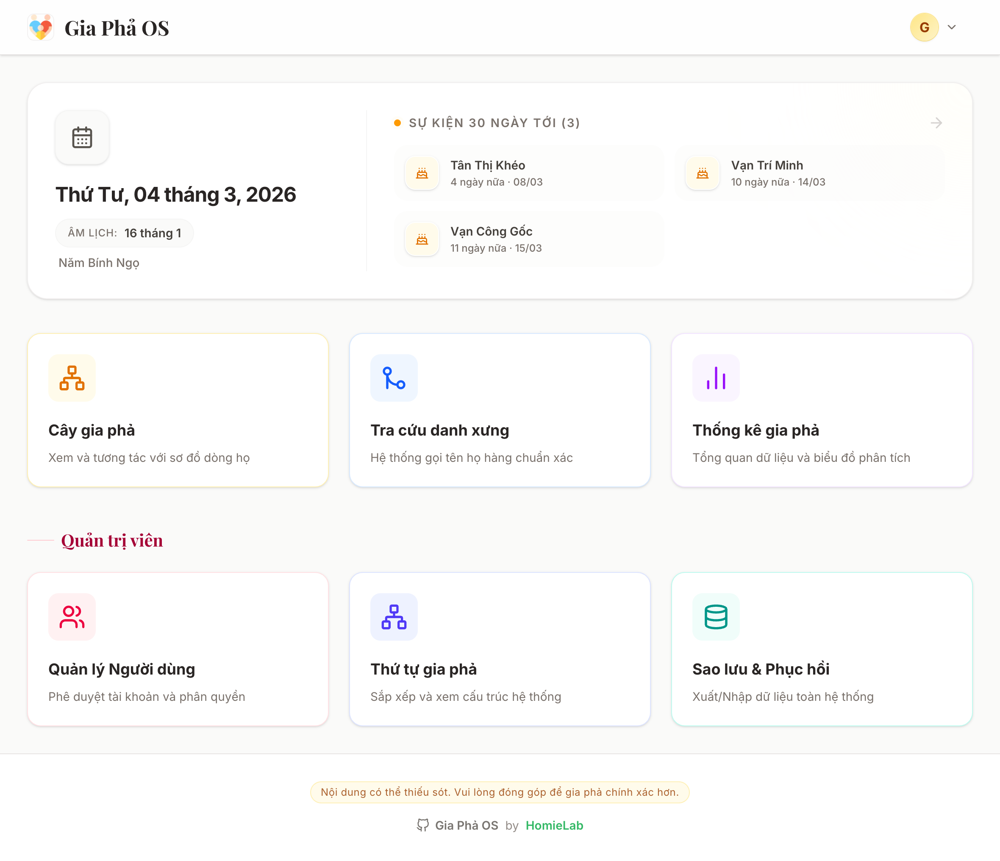
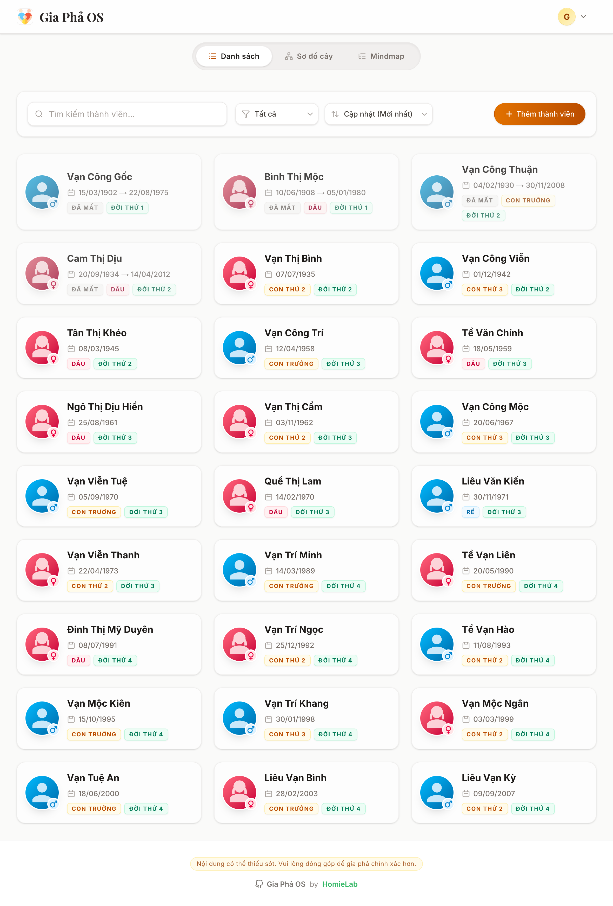
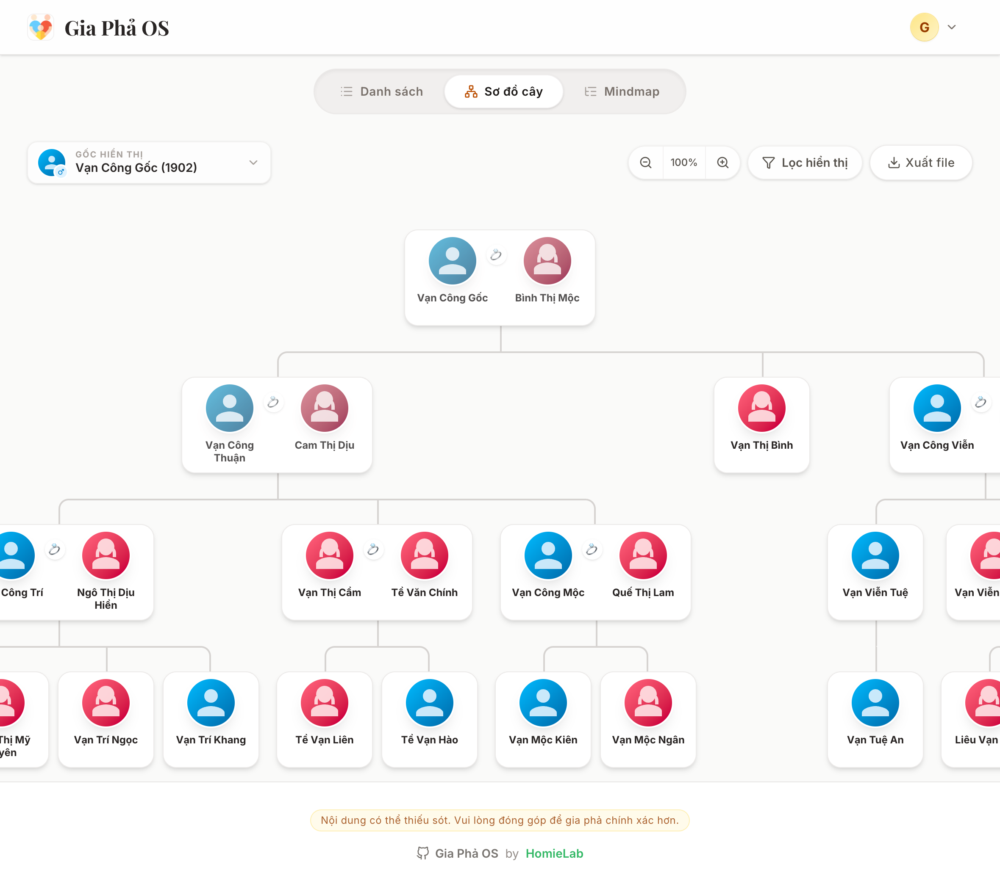
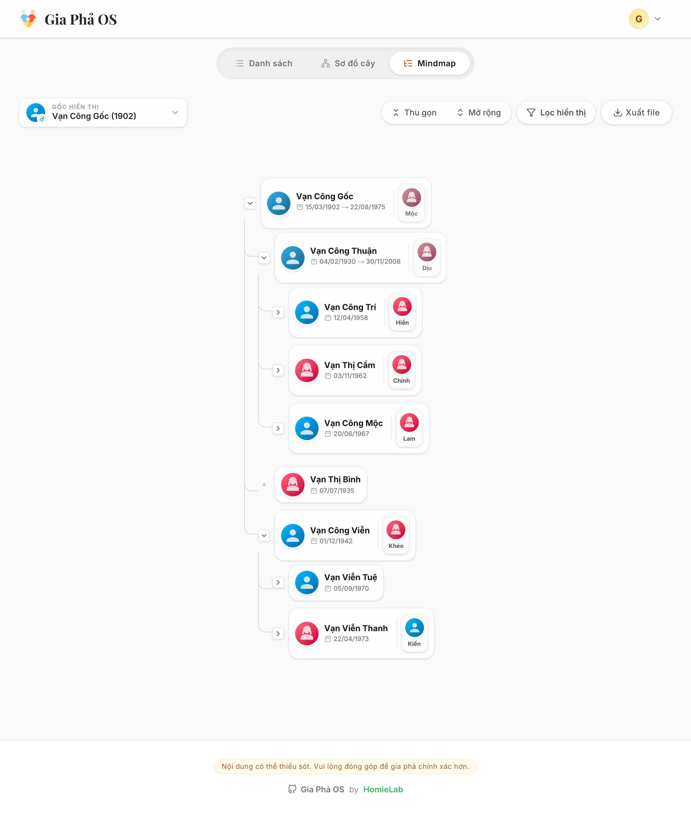
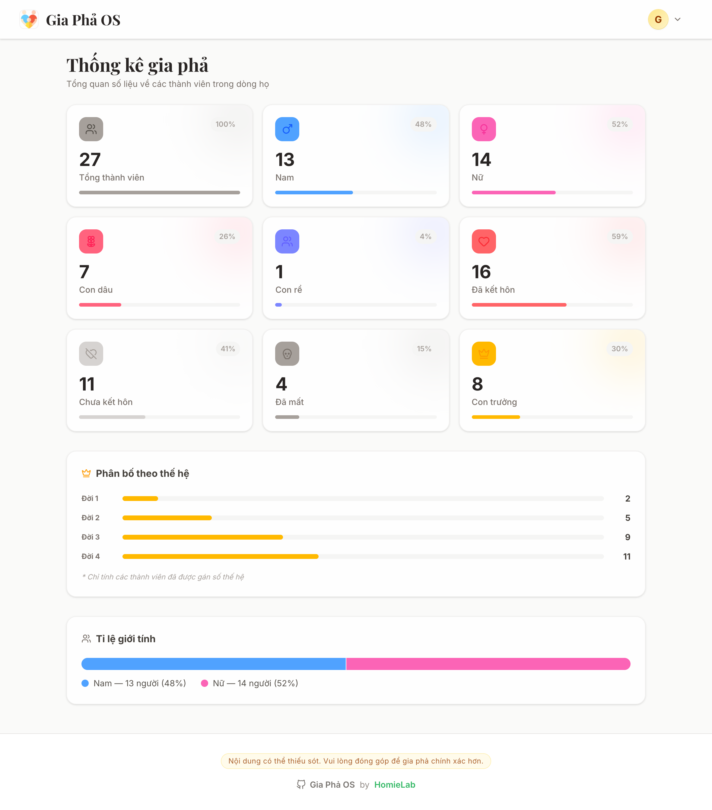
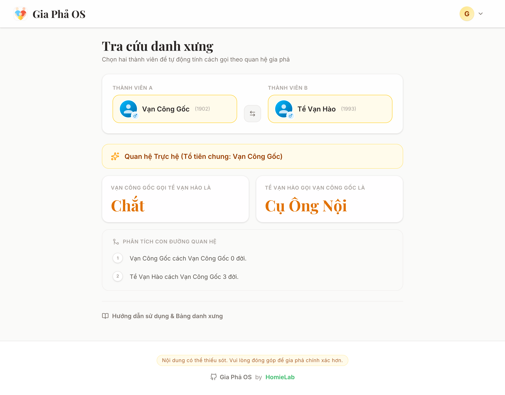
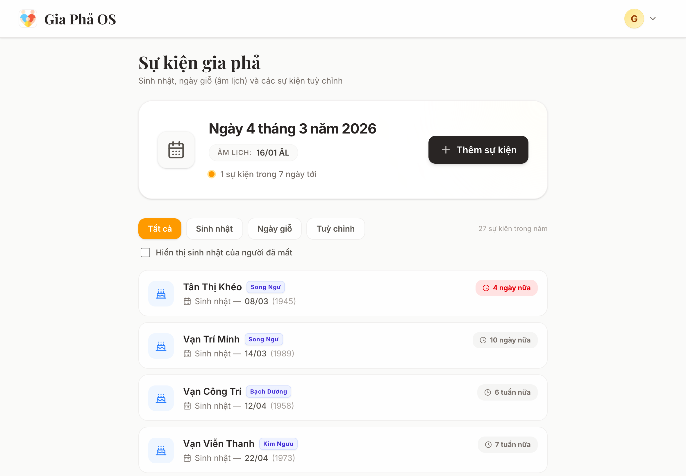

# Gia Phả OS (Gia Phả Open Source)

Đây là mã nguồn mở cho ứng dụng quản lý gia phả dòng họ Việt Nam, cung cấp giao diện trực quan để xem sơ đồ phả hệ, quản lý thành viên, tổ chức sự kiện, điều hành dòng tộc và quản trị vận hành nội bộ.

Dự án ra đời từ nhu cầu thực tế: cần một hệ thống Cloud để con cháu ở nhiều nơi có thể cùng cập nhật thông tin (kết hôn, sinh con...), thay vì phụ thuộc vào một máy cục bộ. Việc tự triển khai mã nguồn mở giúp gia đình bạn nắm trọn quyền kiểm soát dữ liệu nhạy cảm, thay vì phó mặc cho các dịch vụ bên thứ ba.

Phù hợp với người Việt Nam.

---

## Mục lục

- [Các tính năng hiện tại](#các-tính-năng-hiện-tại)
- [Demo](#demo)
- [Hình ảnh Giao diện](#hình-ảnh-giao-diện)
- [Cài đặt và Chạy dự án](#cài-đặt-và-chạy-dự-án)
  - [Cách 1: Deploy nhanh lên Vercel](#cách-1-deploy-nhanh-lên-vercel)
  - [Cách 2: Chạy trên máy cá nhân](#cách-2-chạy-trên-máy-cá-nhân)
- [Các module nghiệp vụ dòng họ](#các-module-nghiệp-vụ-dòng-họ)
- [Phân quyền người dùng (User Roles)](#phân-quyền-người-dùng-user-roles)
- [Tài khoản đầu tiên](#tài-khoản-đầu-tiên)
- [Xử lý lỗi khi đăng ký](#xử-lý-lỗi-khi-đăng-ký)
- [Đóng góp (Contributing)](#đóng-góp-contributing)
- [Tuyên bố từ chối trách nhiệm & Quyền riêng tư](#tuyên-bố-từ-chối-trách-nhiệm--quyền-riêng-tư)
- [Giấy phép (License)](#giấy-phép-license)

---

## Các tính năng hiện tại

### 1) Quản lý gia phả cốt lõi

- **Sơ đồ trực quan đa chế độ**: Tree, Mindmap, Bubble Map.
- **Quản lý thành viên**: hồ sơ cá nhân, avatar, tên khác, giới tính, đời thứ, thứ tự sinh.
- **Mở rộng thông tin gia phả Việt Nam**:
  - Quê quán (`hometown`)
  - Địa chỉ phần mộ (`grave_address`) cho người đã mất
  - Xác định vai vế anh/chị/em như **Trưởng nam / Trưởng nữ / Thứ nam / Thứ nữ**.
- **Quản lý quan hệ**: hôn nhân, con ruột, con nuôi, các trường hợp đặc biệt.
- **Tra cứu danh xưng**: tự động xác định cách xưng hô họ hàng.

### 2) Sự kiện và nghi lễ

- **Sự kiện gia phả**: sinh nhật, ngày giỗ âm lịch, sự kiện tùy chỉnh.
- **Nhắc lễ Tiên thường**: tự động tạo mốc trước ngày giỗ 01 ngày.

### 3) Điều hành dòng họ

- **Tộc quy / Tộc ước / Quy định**: tạo và quản lý văn bản quy ước dòng tộc.
- **Bảng tin dòng họ**: đăng thông báo, ghim tin, cập nhật hoạt động họ tộc.
- **Sổ thu chi dòng tộc**: theo dõi khoản thu/chi, số dư quỹ.

### 4) Quản trị hệ thống

- **Cấu hình chung**:
  - Tên website
  - Logo
  - Nội dung chân trang (footer)
  - Địa chỉ, điện thoại, email liên hệ
- **Quản trị người dùng**: phê duyệt tài khoản, phân quyền admin/editor/member.
- **Sao lưu & phục hồi dữ liệu**:
  - Export/Import JSON
  - Có bao gồm dữ liệu mở rộng như `clan_news`, `hometown`, `grave_address`.

### 5) Bảo mật và triển khai

- **Supabase + RLS** cho bảo vệ dữ liệu.
- **Tối ưu đa thiết bị** (desktop/mobile).
- **Self-hosted**: gia đình tự quản lý hoàn toàn dữ liệu.

---

## Demo

- Demo: [giapha-os.homielab.com](https://giapha-os.homielab.com)
- Tài khoản: `giaphaos@homielab.com`
- Mật khẩu: `giaphaos`

---

## Hình ảnh Giao diện









More screenshots: [docs/screenshots/](docs/screenshots/)

---

## Cài đặt và Chạy dự án

Chỉ cần khoảng 10 -> 15 phút là bạn có thể tự dựng hệ thống gia phả cho gia đình mình.

### 1) Tạo Database (Miễn phí với Supabase)

1. Tạo tài khoản miễn phí tại https://github.com nếu chưa có.
2. Tạo tài khoản miễn phí tại https://supabase.com nếu chưa có.
3. Tạo **New Project**.
4. Vào **Project Settings → API**, lưu lại:
   - `Project URL`
   - `Project API Keys`

> Sau khi deploy/chạy local lần đầu, hãy chạy toàn bộ SQL trong `docs/schema.sql` hoặc các file trong `docs/migrations/` để đồng bộ cấu trúc dữ liệu.

### Cách 1: Deploy nhanh lên Vercel

[](https://vercel.com/new/clone?repository-url=https%3A%2F%2Fgithub.com%2Fngoctu2026%2Fho-pham&env=SITE_NAME,NEXT_PUBLIC_SUPABASE_URL,NEXT_PUBLIC_SUPABASE_PUBLISHABLE_DEFAULT_KEY)

1. Tạo tài khoản miễn phí tại https://vercel.com nếu chưa có.
2. Nhấn nút Deploy bên trên.
3. Điền các biến môi trường:
   - `SITE_NAME` = Tên website bạn muốn hiển thị (ví dụ: `Gia Phả Họ Phạm`)
   - `NEXT_PUBLIC_SUPABASE_URL` = `Project URL`
   - `NEXT_PUBLIC_SUPABASE_PUBLISHABLE_DEFAULT_KEY` = `Project API Keys`
4. Nhấn **Deploy** và chờ 2 -> 3 phút.

> Sau khi deploy xong, vào Supabase Dashboard → **Authentication → URL Configuration**:
>
> - **Site URL**: `https://ten-du-an.vercel.app`
> - **Redirect URLs**:
>   - `https://ten-du-an.vercel.app/**`
>   - `http://localhost:3000/**`

### Cách 2: Chạy trên máy cá nhân

Yêu cầu: máy đã cài [Node.js](https://nodejs.org/en) và [Bun](https://bun.sh/)

1. Clone hoặc tải project về máy.
2. Đổi tên file `.env.example` thành `.env.local`.
3. Điền biến môi trường:

```env
SITE_NAME="Gia Phả OS"
NEXT_PUBLIC_SUPABASE_URL="https://your-project.supabase.co"
NEXT_PUBLIC_SUPABASE_PUBLISHABLE_DEFAULT_KEY="your-anon-key"
```

4. Cài thư viện

```bash
bun install
```

5. Chạy dự án

```bash
bun run dev
```

Mở trình duyệt và truy cập: `http://localhost:3000`.

---

## Các module nghiệp vụ dòng họ

- `/dashboard/members`: quản lý thành viên và quan hệ.
- `/dashboard/events`: lịch sự kiện, giỗ, tiên thường.
- `/dashboard/kinship`: tra cứu danh xưng.
- `/dashboard/clan`: tộc quy / tộc ước / quy định.
- `/dashboard/news`: bảng tin dòng họ.
- `/dashboard/finance`: sổ thu chi dòng tộc.
- `/dashboard/settings`: cấu hình chung logo + footer.
- `/dashboard/data`: sao lưu & phục hồi.

---

## Phân quyền người dùng (User Roles)

1. **Admin (Quản trị viên):** toàn quyền hệ thống, gồm người dùng, dữ liệu và cấu hình.
2. **Editor (Biên soạn):** thêm/sửa/xóa nội dung nghiệp vụ (thành viên, tin tức, tài liệu, thu chi...).
3. **Member (Thành viên):** chủ yếu xem dữ liệu gia phả và thông tin công khai.

---

## Tài khoản đầu tiên

- Đăng ký tài khoản mới khi vào web lần đầu.
- Người đăng ký đầu tiên sẽ tự động có quyền **admin**.
- Các tài khoản đăng ký sau sẽ mặc định là **member**.

---

## Xử lý lỗi khi đăng ký

Nếu gặp lỗi `Failed to fetch` khi đăng ký:

1. Vào Supabase Dashboard → **Authentication → URL Configuration**.
2. Điền đúng **Site URL** và **Redirect URLs** theo domain bạn đang dùng.

Ví dụ:

- `https://giapha-os.vercel.app/**`
- `http://localhost:3000/**`

---

## Đóng góp (Contributing)

Dự án là mã nguồn mở, hoan nghênh mọi đóng góp, báo lỗi (issues) và pull requests.

---

## Tuyên bố từ chối trách nhiệm & Quyền riêng tư

> **Dự án này chỉ cung cấp mã nguồn (source code). Không có bất kỳ dữ liệu cá nhân nào được thu thập hay lưu trữ bởi tác giả.**

- **Tự lưu trữ hoàn toàn (Self-hosted):** dữ liệu nằm trong tài khoản Supabase của bạn.
- **Không thu thập dữ liệu người dùng** trong mã nguồn mặc định.
- **Bạn kiểm soát dữ liệu của bạn**: có thể xóa/xuất/di chuyển bất cứ lúc nào.
- **Demo công khai** dùng dữ liệu mẫu hư cấu.

---

## Giấy phép (License)

Dự án được phân phối dưới giấy phép MIT.
